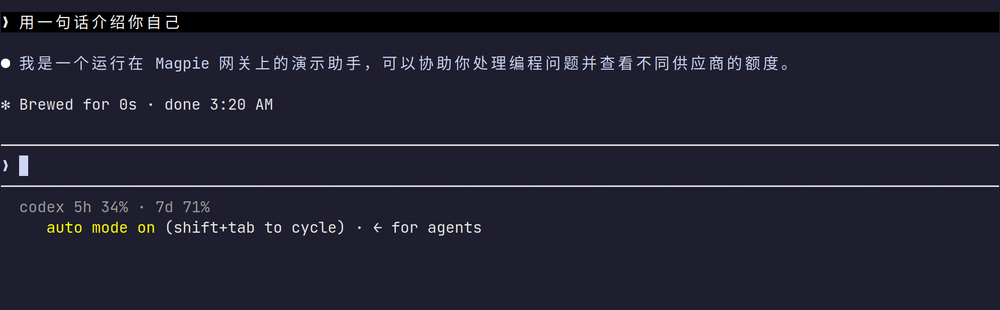
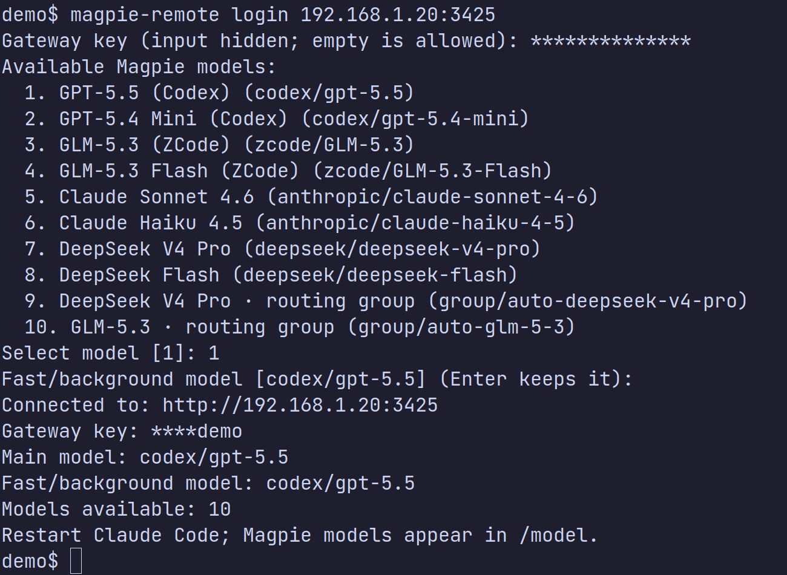
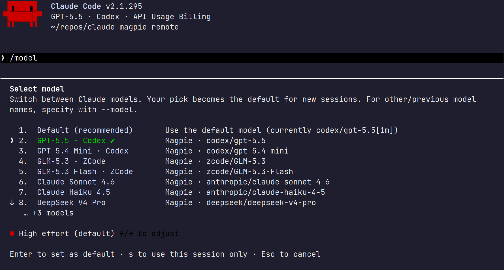
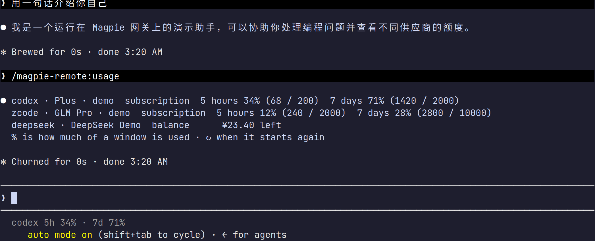

# claude-magpie-remote

让 [Claude Code](https://docs.anthropic.com/en/docs/claude-code/overview) 连接另一台机器上的 [Magpie](https://github.com/yetone/magpie) 网关：选择远程模型，在状态栏查看额度，或随时查询完整用量。

- **远程模型**：将 Magpie catalog 写入 Claude Code 的 `modelPicker`，包括 `codex/...`、`zcode/...` 和路由组模型。
- **额度显示**：状态栏展示当前模型供应商的用量或余额；`/magpie-remote:usage` 查看网关额度。
- **可恢复配置**：登录时快照插件将修改的设置，退出登录时恢复。
- **权限模式建议**：auto 模式的分类器请求会绕开所选模型，推荐改用 `bypassPermissions` 等模式，见[权限模式](#权限模式不要使用-auto)。
- **零运行时依赖**：使用 Node.js 内置 API，支持 Node.js 16 及以上版本。



> 下方截图均来自真实 Claude Code 2.1.295 和本地假 Magpie 网关，使用演示模型与额度数据。

## 要求

- Claude Code 2.1.242 或更新版本（支持用户级 `modelPicker`）。
- Node.js 16 或更新版本。
- Magpie 网关已开启 **设置 → 局域网共享（Share on local network）**，并准备好一个 gateway key。

## 安装

在 Claude Code 中添加 marketplace 并安装插件：

```sh
claude plugin marketplace add LiangNiang/claude-magpie-remote
claude plugin install magpie-remote@claude-magpie-remote
```

`magpie-remote` CLI 可全局安装，或用 `npx` 从 GitHub 临时运行。仓库的 `package.json` 将单个可执行文件 `magpie-remote` 映射到 `bin/magpie-remote`：

```sh
npm install -g github:LiangNiang/claude-magpie-remote
magpie-remote login
```

```sh
npx --yes --package=github:LiangNiang/claude-magpie-remote magpie-remote login
```

## 配置 Magpie

在运行 Magpie 的机器上：

1. 开启 **设置 → 局域网共享（Share on local network）**。
2. 运行 `magpie gateway-key add` 创建 gateway key。
3. 记下 Claude Code 所在机器可访问的地址（例如 `http://192.168.1.20:3425`）和 key。

## 登录

```sh
magpie-remote login
```

交互式填写网关地址和 gateway key，从 catalog 中选择主模型与快速 / 后台模型。地址可以带或不带 `/v1`；key 输入时不会回显，CLI 仅显示末尾字符。

也可使用命令行参数：

```sh
magpie-remote login [address] \
  --key sk-magpie-... \
  --model codex/gpt-5.5 \
  --fast-model codex/gpt-5.4-mini \
  --no-statusline
```

`--no-statusline` 为可选项；省略后，若用户未设置自己的状态栏，CLI 会配置 Magpie 状态栏。主模型和快速 / 后台模型都必须存在于远端 catalog 中。

登录会将 Claude Code 全局配置中的首次设置标记为已完成，因此跳过主题和登录方式选择；每个文件夹的 workspace trust prompt 仍会显示。



### 模型列表如何工作

Claude Code 内置的 gateway model discovery 只会收录 ID 中含 `claude` 或 `anthropic` 的模型，因此常会漏掉 `codex/...`、`zcode/...` 或 Magpie 路由组。本插件改用用户级 `modelPicker`，按 catalog 顺序列出 Magpie 模型，并设置 `replaceBuiltInOptions: true` 替换内置列表；`/model` 仍会显示 Claude Code 的 `Default` 和当前会话模型项。Claude Code 原生模型选项不会通过 Magpie 网关路由，因此不会保留在列表中。带非空 `kind` 的条目（例如图片模型）不会加入。

若用户已有自己的 `modelPicker`，登录会保留它并提示，不会覆盖。插件拥有的 picker 会在 Claude Code 每次启动时由 `SessionStart` hook 静默刷新；只有已登录且设置中的网关地址仍匹配时才刷新。若插件未安装或未启用，hook 不会运行；重新安装插件后若列表未更新，可重新运行 `magpie-remote login`。

`modelPicker` 与 `statusLine` 都遵循所有权规则：用户已有自定义设置时不会覆盖。登录快照第一次登录前的原值，`magpie-remote logout` 会还原设置并移除复制到配置目录的 CLI 库。

选择非 Claude 模型（例如 `codex/...` 或 `zcode/...`）时，Claude Code 可能提示该模型不在其内置模型 catalog 中，并按 200k token 窗口处理自动压缩。这是 Claude Code 的模型元数据提示；模型仍可通过 Magpie 使用。

## 查看额度

当前模型对应的供应商额度显示在 Claude Code 状态栏，例如 `codex 5h 34% · 7d 71%` 或 `deepseek ¥23.40`。同一供应商有多个账号时，优先显示最近一次经网关服务的账号；`+N` 表示还有 N 个额度条目。

状态栏默认每 60 秒刷新一次。用量达到 75% 时变黄，达到 90% 时变红；请求失败时，仅在缓存来自同一网关地址的情况下使用过期额度。



显示完整额度，或按供应商筛选：

```text
/magpie-remote:usage
/magpie-remote:usage codex
```



普通终端中的 CLI 会直接输出额度，不需要 Claude 模型回复：

```sh
magpie-remote usage
magpie-remote usage codex
magpie-remote usage --json
```

`/magpie-remote:usage` 会在 Claude Code 会话中查询额度，并要求 Claude 将结果原样放入文本代码块；因此仍会产生一次 Claude 回复并消耗额度。Claude Code 中的 `! magpie-remote usage` 虽然执行 shell 命令，命令结果也会返回给 Claude，随后可能触发一次模型回复并消耗额度。若只需要直接查看数字，请在普通终端运行 `magpie-remote usage`。

## 权限模式：不要使用 auto

Claude Code 2.1.283 起，终端会话默认进入 auto 权限模式。auto 模式会在 Claude 执行命令、修改文件前额外发送一次**分类器**请求审查操作；分类器默认使用写死的 `claude-sonnet-5`，不受 `/model` 选择和 `ANTHROPIC_DEFAULT_*_MODEL` 影响。经 Magpie 使用时会带来：

- Magpie 请求日志中出现不带供应商前缀的 `claude-sonnet-5` 请求，由 Magpie 自行挑选提供该模型的供应商，绕开你选的模型；
- 每次工具调用都多一次请求，额外消耗额度。

建议改用不调用分类器的模式。在 `~/.claude/settings.json` 中设置默认权限模式（已有 `permissions` 时合并进去，不要覆盖）：

```json
{
  "permissions": {
    "defaultMode": "bypassPermissions"
  }
}
```

| `defaultMode` | 行为 |
| :- | :- |
| `bypassPermissions` | 完全允许：执行命令、修改文件都不询问 |
| `acceptEdits` | 自动允许修改文件，执行命令前询问 |
| `default` | 普通模式（Manual）：命令和修改文件前都询问 |

- `bypassPermissions` 只能写在用户级 `~/.claude/settings.json`（或 managed settings）中；写在项目的 `.claude/settings.json` / `.claude/settings.local.json` 中不生效，会话会以普通模式启动。
- 单次启动可用 `claude --dangerously-skip-permissions`（等同 `--permission-mode bypassPermissions`）；`claude --allow-dangerously-skip-permissions` 只把该模式加入 Shift+Tab 循环，不直接开启。
- 会话中按 Shift+Tab 切换模式，状态栏显示当前模式（如 `⏵⏵ bypass permissions on`、`⏸ manual mode on`）；从 auto 按一次即切到普通模式。
- 若要彻底从 Shift+Tab 循环中移除 auto，在设置中加入 `"disableAutoMode": "disable"`。
- 设置非 auto 的 `defaultMode` 后，Claude Code 可能询问一次是否改为 auto，选择不修改即可。

> **注意**：`bypassPermissions` 下 Claude 执行任何命令、修改任何文件都不再询问，也没有分类器拦截危险操作（少数关键路径删除等仍会确认）。官方建议仅在容器、虚拟机等隔离环境中使用；介意风险时请改用 `acceptEdits` 或 `default`。

## 状态、登出与故障排查

```sh
magpie-remote status
magpie-remote logout
```

`status` 显示连接地址、脱敏后的 key、所选模型和远端模型数量。`logout` 恢复登录前的配置（包括全局首次设置标记）；之后由 Claude Code 或插件安装过程添加的其他设置会保留。

- **401 / 403**：检查 gateway key 是否仍有效，以及 Magpie 的局域网共享是否开启。
- **无法连接或模型列表为空**：确认地址可从 Claude Code 所在机器访问，并检查防火墙和端口；登录要求 catalog 至少包含一个可选模型。
- **启动后模型列表未刷新**：确认插件已安装并启用；必要时重新运行 `magpie-remote login`。
- **状态栏未能启动**：状态栏命令使用 Claude Code `PATH` 中的 `node`；切换 Node 版本（例如 nvm）后，请从新 shell 重启 Claude Code。
- **自定义状态栏未显示 Magpie 额度**：这是预期行为，插件不会替换用户自己的 `statusLine`。可在自己的脚本中调用 `node "<配置目录>/magpie-remote/lib/cli.mjs" statusline`。

## 开发

```sh
npm install
npm run check
npm test
```

对正在使用的 Magpie 做只读冒烟测试，仅请求 `/v1/models` 和 `/v1/magpie/quotas`，不会发起对话：

```sh
MAGPIE_URL=http://192.168.1.20:3425 MAGPIE_GATEWAY_KEY=sk-magpie-... npm run smoke
```

未设置 `MAGPIE_URL` 时冒烟测试会跳过。
